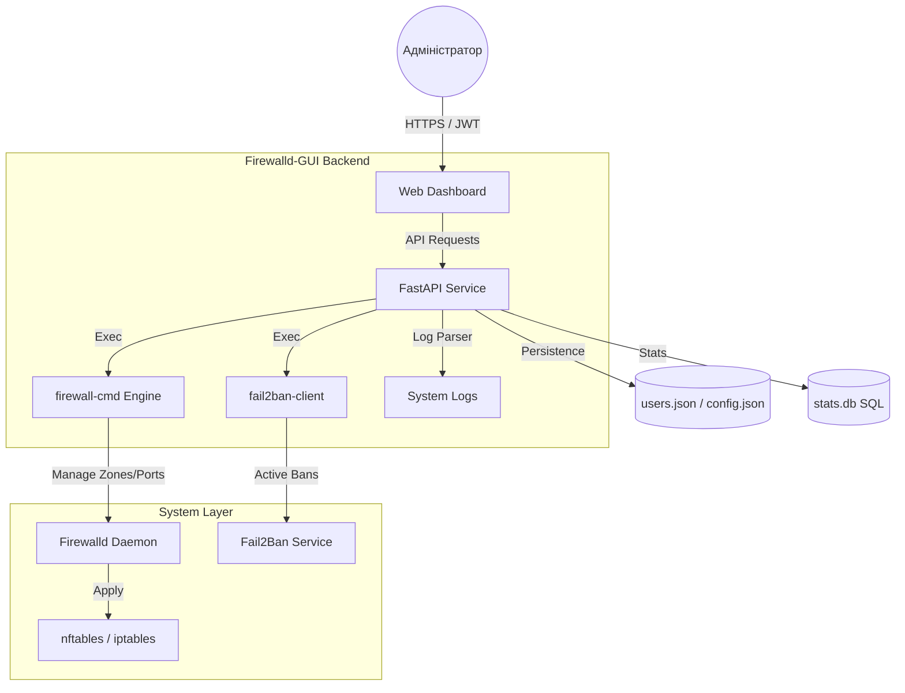

<p align="center">
  <a href="README_ENG.md">
    
  </a>
  <a href="README.md">
    
  </a>
</p>

<br>

# 🛡️ Firewalld-GUI (Weby Homelab)
*Сучасне, швидке та естетичне керування мережевою безпекою Linux.*

[](https://github.com/weby-homelab/firewalld-gui/releases/latest)
[](LICENSE)
[]()

**Firewalld-GUI** — це потужний веб-інтерфейс для керування `firewalld` та `Fail2Ban`, створений для системних адміністраторів, які цінують свій час та хочуть мати повну візуальну картину безпеки сервера. Він перетворює складні консольні команди на інтуїтивно зрозумілий дашборд із аналітикою в реальному часі.

---

## 🧩 Архітектура системи



---

## ✨ Ключові можливості

- **🚀 Візуальний Rule Builder:** Створюйте складні правила, керуйте портами та сервісами в один клік без ризику синтаксичних помилок.
- **🕵️‍♂️ Fail2Ban Integration:** Повний контроль над активними банами. Переглядайте статус джейлів, історію атак та розбанюйте IP безпосередньо з інтерфейсу.
- **🕰️ Auto-Snapshots:** Система автоматично робить бекап поточної конфігурації перед кожною зміною. Ви завжди можете повернутися до стабільного стану.
- **📈 Real-time Analytics:** Відстежуйте статистику відхилених пакетів (DROP/REJECT) та активність зловмисників через інтегровані графіки.
- **🌍 IP Intelligence:** Вбудований Whois-сервіс дозволяє миттєво ідентифікувати провайдера та країну походження будь-якої заблокованої адреси.

---

## 🛠️ Швидкий старт

### Використання Docker
```bash
git clone https://github.com/weby-homelab/firewalld-gui.git
cd firewalld-gui
docker compose up -d
```
*Важливо: `--privileged` та `--network host` необхідні для прямої взаємодії з демоном firewalld на хості.*

### Встановлення як сервіс
Детальні інструкції для AlmaLinux та Ubuntu доступні в розділі **Installation Guide** в `README_ENG.md`.

---

## 📋 Системні вимоги
- **ОС:** AlmaLinux 9+, RHEL 9+, Ubuntu 22.04/24.04.
- **Залежності:** `firewalld`, `fail2ban`, `python3.12+`.
- **Доступ:** Права `root` для виконання системних команд.

---
<p align="center">
  Made with ❤️ in Kyiv under air raid sirens and blackouts<br>
  <strong>✦ 2026 Weby Homelab ✦</strong>
</p>
