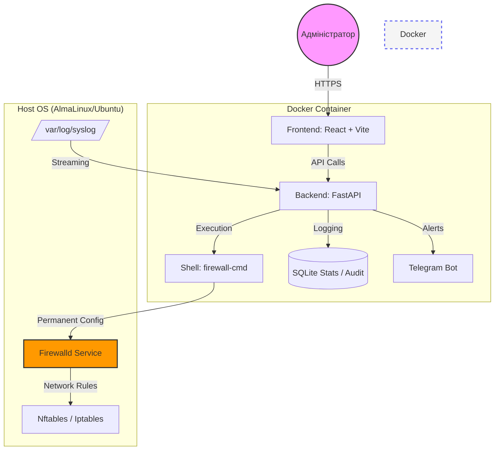

# Firewalld-GUI 🛡️

Сучасна, швидка та потужна веб-панель для керування `firewalld`, розроблена спеціально для серверів на базі **AlmaLinux 10**, **Ubuntu 24.04** та інших сучасних дистрибутивів.


## 🏗 Архітектура системи



## 🚀 Основні можливості

### 🛠 Керування сервісами (Service Architect)
- **Custom Services**: Створюйте власні описи сервісів, групуючи порти та протоколи.
- **Інформативний UI**: Переглядайте порти кастомних сервісів прямо у списку.
- **Розумний пошук**: Миттєва фільтрація серед 260+ системних дефініцій.
- **Collapsible System List**: Системні сервіси згорнуті за замовчуванням для чистоти інтерфейсу.

### 🧱 Життєвий цикл об'єктів
- **Зони та Політики**: Створення та видалення об'єктів фаєрвола прямо з браузера.
- **Global Config**: Керування параметрами `firewalld.conf`, зміна зони за замовчуванням (Default Zone) та налаштування логування (Log Denied).

### 🔍 Розумна аналітика та Безпека
- **Geo-IP Integration**: Відстежуйте країну походження кожної атаки у реальному часі.
- **Anomaly Detection**: Автоматичні сповіщення в Telegram при сплесках активності (DDoS/Brute-force).
- **ICMP Management**: Повне керування блокуванням ICMP-типів з миттєвим застосуванням змін та ультра-помітним дизайном карток.

### 🛡 Безпека та Надійність
- **Safe Mode**: Автоматичне створення знімків (Snapshots) перед кожною зміною.
- **Система відкатів**: Можливість миттєво відновити попередню стабільну конфігурацію.
- **Dual-Channel Execution**: Бекенд об'єднує stdout/stderr для 100% надійності виконання команд на нових ядрах Linux.

## 📦 Встановлення через Docker

```yaml
services:
  firewalld-gui:
    image: webyhomelab/firewalld-gui-backend:latest
    privileged: true
    network_mode: host
    volumes:
      - /etc/firewalld:/etc/firewalld
      - /var/log:/var/log:ro
```

---
© 2026 **Weby Homelab**
