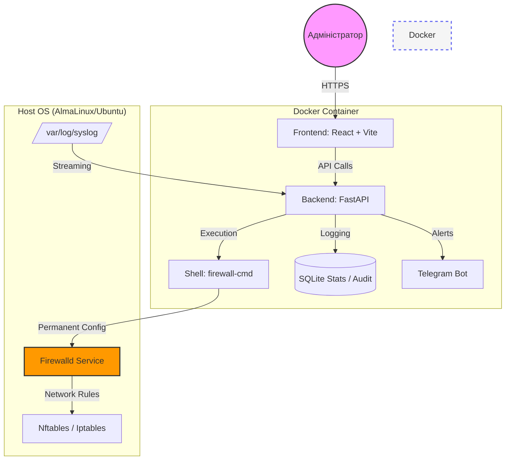

<p align="center">
  <a href="README_ENG.md">
    
  </a>
  <a href="README.md">
    
  </a>
</p>

<br>

# 🛡️ Firewalld-GUI (Weby Homelab)
*Сучасне, швидке та естетичне керування мережевою безпекою Linux.*

[](https://github.com/weby-homelab/firewalld-gui/releases/latest)
[](LICENSE)
[]()

**Firewalld-GUI** — це професійна веб-панель для керування `firewalld` та `Fail2Ban`, створена спеціально для серверів на базі **AlmaLinux 10**, **Ubuntu 24.04** та інших сучасних дистрибутивів. Вона перетворює складні консольні команди на інтуїтивно зрозумілий дашборд із аналітикою в реальному часі.

---

## 🏗 Архітектура системи



---

## 🚀 Основні можливості

### 🛠 Керування сервісами (Service Architect)
- **Custom Services**: Створюйте власні описи сервісів, групуючи порти та протоколи.
- **Інформативні картки**: Переглядайте вміст сервісів (порти) прямо у списку без зайвих кліків.
- **Розумний пошук**: Миттєва фільтрація серед 260+ системних дефініцій.
- **Collapsible UI**: Системні сервіси згорнуті за замовчуванням для візуальної чистоти.

### 🧱 Життєвий цикл об'єктів
- **Зони та Політики**: Створення, редагування та видалення об'єктів фаєрвола через браузер.
- **Global Config**: Повний доступ до `firewalld.conf` (Default Zone, Log Denied).
- **Target Actions**: Налаштування стандартної поведінки (ACCEPT, REJECT, DROP) для будь-якої зони.

### 🔍 Threat Intelligence & Аналітика
- **Geo-IP Integration**: Відстежуйте країну походження кожної атаки у реальному часі.
- **Anomaly Detection**: Автоматичні сповіщення в Telegram при виявленні сплесків атак.
- **Fail2Ban Control**: Повний контроль над активними банами та статусом джейлів.
- **Visual Analytics**: Графіки активності відхилених пакетів у реальному часі.

### 🛡 Безпека та Надійність
- **Auto-Snapshots**: Система автоматично робить бекап перед кожною зміною конфігурації.
- **Dual-Channel Execution**: Бекенд об'єднує stdout/stderr для 100% надійності на нових Linux-ядрах.
- **Safe Migration**: Майстер безпечного перенесення SSH-портів.

---

## 📦 Встановлення (Docker Compose)

Для запуску повного стеку (Backend, Frontend, Nginx) використовуйте наступний `docker-compose.yml`:

```yaml
services:
  firewalld-backend:
    image: webyhomelab/firewalld-gui-backend:latest
    container_name: firewalld-gui-backend
    network_mode: host
    privileged: true
    volumes:
      - ./data:/app/data
      - /etc/firewalld:/etc/firewalld
      - /run/dbus/system_bus_socket:/run/dbus/system_bus_socket
      - /var/run/fail2ban/fail2ban.sock:/var/run/fail2ban/fail2ban.sock
      - /var/log:/var/log:ro
    restart: always

  firewalld-frontend:
    image: webyhomelab/firewalld-gui-frontend:latest
    container_name: firewalld-gui-frontend
    network_mode: host
    restart: always

  firewalld-nginx:
    image: nginx:alpine
    container_name: firewalld-gui-nginx
    network_mode: host
    volumes:
      - ./docker/nginx.conf:/etc/nginx/conf.d/default.conf:ro
    depends_on:
      - firewalld-backend
      - firewalld-frontend
    restart: always
```

---

## 📋 Системні вимоги
- **ОС:** AlmaLinux 9/10, Ubuntu 22.04/24.04, RHEL 9+.
- **Залежності:** `firewalld`, `fail2ban`, `docker`.
- **Доступ:** Права `root` (або `privileged` в Docker) для прямої взаємодії з ядром.

---
<p align="center">
  Made with ❤️ in Kyiv under air raid sirens and blackouts<br>
  <strong>✦ 2026 Weby Homelab ✦</strong>
</p>
