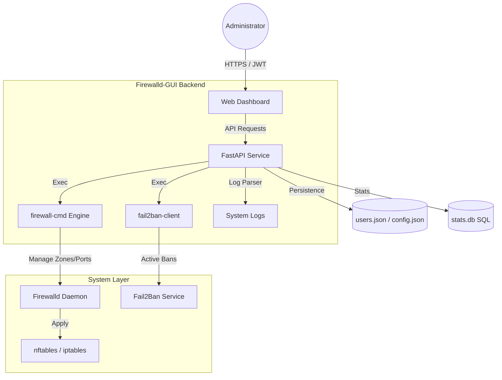

<p align="center">
  <a href="README_ENG.md">
    
  </a>
  <a href="README.md">
    
  </a>
</p>

<br>

# 🛡️ Firewalld-GUI (Weby Homelab)
*Modern, Fast, and Aesthetic Linux Network Security Management.*

[](https://github.com/weby-homelab/firewalld-gui/releases/latest)
[](LICENSE)
[]()

**Firewalld-GUI** is a powerful web interface for managing `firewalld` and `Fail2Ban`, built for system administrators who value their time and want a complete visual picture of server security. It transforms complex console commands into an intuitive dashboard with real-time analytics.

---

## 🧩 System Architecture



---

## ✨ Key Features

- **🚀 Visual Rule Builder:** Create complex rules, manage ports, and services in one click without the risk of syntax errors.
- **🕵️‍♂️ Fail2Ban Integration:** Full control over active bans. View jail status, attack history, and unban IPs directly from the interface.
- **🕰️ Auto-Snapshots:** The system automatically backs up the current configuration before every change. You can always revert to a stable state.
- **📈 Real-time Analytics:** Track statistics of rejected packets (DROP/REJECT) and attacker activity through integrated charts.
- **🌍 IP Intelligence:** Built-in Whois service allows you to instantly identify the provider and country of origin for any blocked address.

---

## 🛠️ Quick Start

### Using Docker
```bash
git clone https://github.com/weby-homelab/firewalld-gui.git
cd firewalld-gui
docker compose up -d
```
*Note: `--privileged` and `--network host` are required for direct interaction with the firewalld daemon on the host.*

---

## 📋 System Requirements
- **OS:** AlmaLinux 9+, RHEL 9+, Ubuntu 22.04/24.04.
- **Dependencies:** `firewalld`, `fail2ban`, `python3.12+`.
- **Access:** `root` privileges for system command execution.

---
<p align="center">
  Made with ❤️ in Kyiv under air raid sirens and blackouts<br>
  <strong>✦ 2026 Weby Homelab ✦</strong>
</p>
