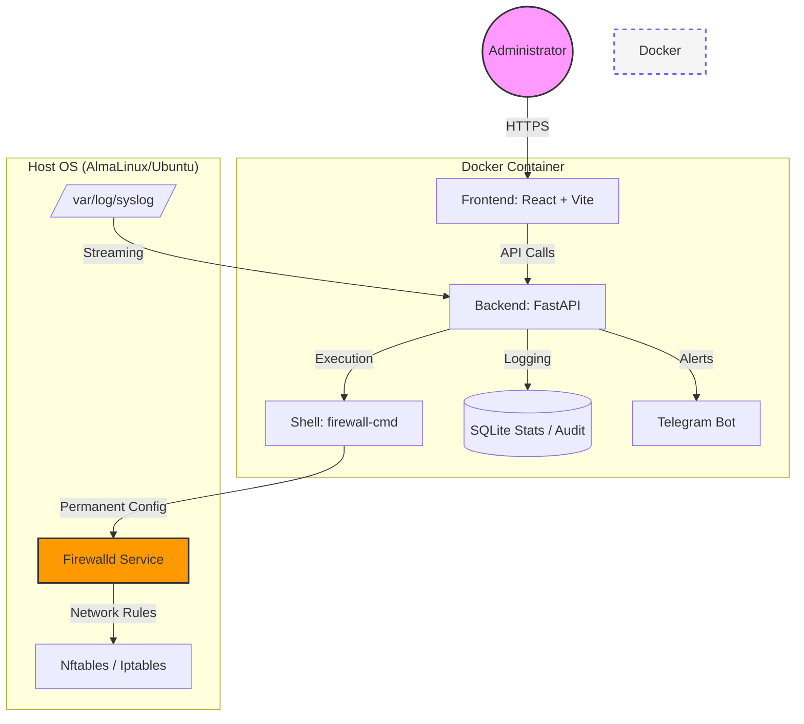

# Firewalld-GUI 🛡️

A modern, fast, and powerful web interface for `firewalld`, specifically designed for servers running **AlmaLinux 10**, **Ubuntu 24.04**, and other contemporary Linux distributions.


## 🏗 System Architecture



## 🚀 Key Features

### 🛠 Service Management (Service Architect)
- **Custom Services**: Define your own service structures by grouping ports and protocols.
- **Informative UI**: View custom service ports directly in the list view.
- **Smart Search**: Instantly filter through 260+ system service definitions.
- **Collapsible System List**: System services are collapsed by default for a clutter-free experience.

### 🧱 Object Lifecycle
- **Zones & Policies**: Create or delete firewall objects directly from your browser.
- **Global Config**: Manage `firewalld.conf` settings, change Default Zone, and adjust Log Denied levels.

### 🔍 Threat Intelligence & Security
- **Geo-IP Integration**: Track the origin country of every blocked attack in real-time.
- **Anomaly Detection**: Automated Telegram alerts for traffic spikes (DDoS/Brute-force).
- **ICMP Management**: Full control over ICMP types with instant application and high-visibility card design.

### 🛡 Safety & Reliability
- **Safe Mode**: Automatic snapshots created before every configuration change.
- **Snapshot Restoration**: Instant rollback to previous stable configurations.
- **Dual-Channel Execution**: Backend merges stdout/stderr for 100% reliable command execution on new Linux kernels.

## 📦 Docker Installation

```yaml
services:
  firewalld-gui:
    image: webyhomelab/firewalld-gui-backend:latest
    privileged: true
    network_mode: host
    volumes:
      - /etc/firewalld:/etc/firewalld
      - /var/log:/var/log:ro
```

---
© 2026 **Weby Homelab**
