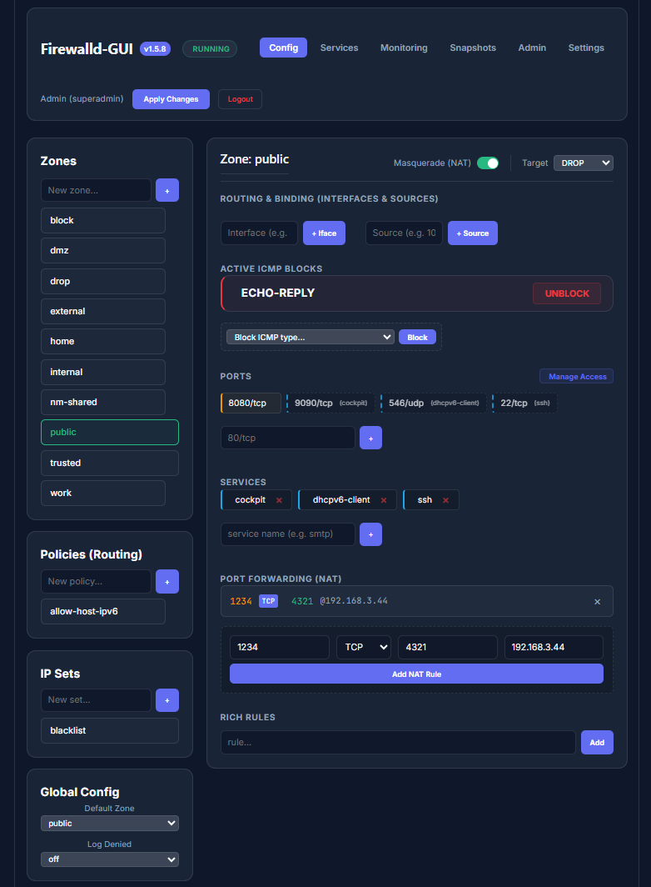
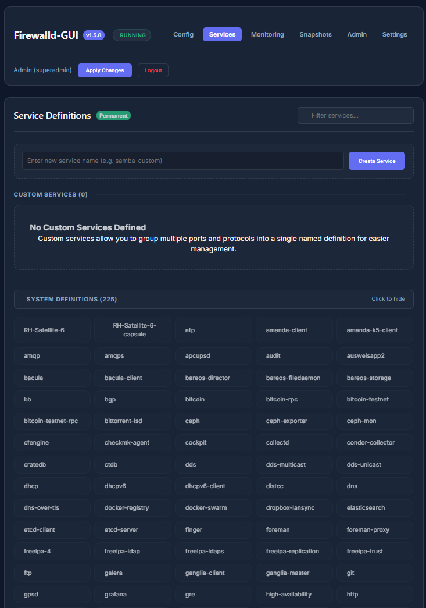
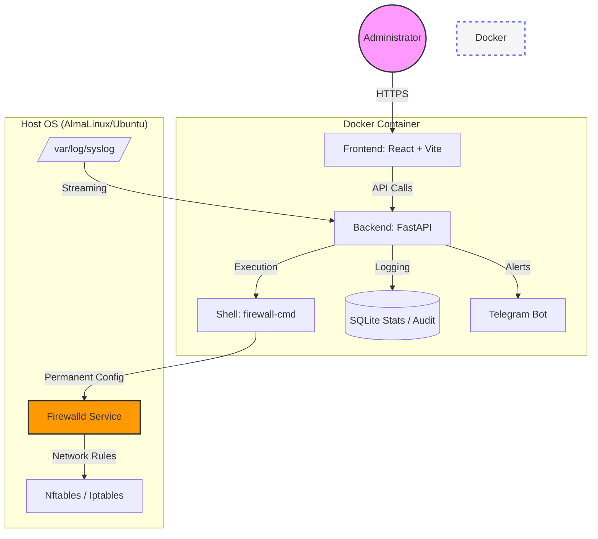

<p align="center">
  <a href="README_ENG.md">
    
  </a>
  <a href="README.md">
    
  </a>
</p>

<br>

# 🛡️ Firewalld-GUI (Weby Homelab)
*Modern, fast, and aesthetic network security management for Linux.*

[](https://github.com/weby-homelab/firewalld-gui/releases/latest)
[](INSTRUCTIONS_ENG.md)
[](LICENSE)
[]()

**Firewalld-GUI** is a professional web-based control panel for managing `firewalld` and `Fail2Ban`, specifically built for servers running **AlmaLinux 10**, **Ubuntu 24.04**, and other modern distributions. It transforms complex CLI commands into an intuitive dashboard with real-time analytics.




---

## 📖 Documentation (Zero to Hero)
For those who want to quickly deploy the system and use all its features to the fullest, we've prepared a comprehensive guide:
👉 [**Full setup and usage guide (Zero to Hero)**](INSTRUCTIONS_ENG.md)

---

## 🏗 System Architecture



---

## 🚀 Key Features

### 🛠 Service Management (Service Architect)
- **Custom Services**: Create your own service definitions by grouping ports and protocols.
- **Informative Cards**: View service contents (ports) directly in the list without extra clicks.
- **Smart Search**: Instantly filter through 260+ system service definitions.
- **Collapsible UI**: System services are collapsed by default for visual clarity.

### 🧱 Object Lifecycle
- **Zones & Policies**: Create, edit, and delete firewall objects via browser.
- **Global Config**: Full access to `firewalld.conf` (Default Zone, Log Denied).
- **Target Actions**: Configure default behavior (ACCEPT, REJECT, DROP) for any zone.

### 🔍 Threat Intelligence & Analytics
- **Geo-IP Integration**: Track the origin country of every attack in real-time.
- **Anomaly Detection**: Automatic Telegram alerts for traffic spikes.
- **Fail2Ban Control**: Full control over active bans and jail status.
- **Visual Analytics**: Real-time activity charts for dropped packets.

### 🛡 Safety & Reliability
- **Auto-Snapshots**: System automatically backs up configuration before any change.
- **Dual-Channel Execution**: Backend merges stdout/stderr for 100% reliability on new Linux kernels.
- **Safe Migration**: Guided wizard for secure SSH port migration.

---

## 📦 Installation (Docker Compose)

To run the full stack (Backend, Frontend, Nginx), use the following `docker-compose.yml`:

```yaml
services:
  firewalld-backend:
    image: webyhomelab/firewalld-gui-backend:latest
    container_name: firewalld-gui-backend
    network_mode: host
    privileged: true
    volumes:
      - ./data:/app/data
      - /etc/firewalld:/etc/firewalld
      - /run/dbus/system_bus_socket:/run/dbus/system_bus_socket
      - /var/run/fail2ban/fail2ban.sock:/var/run/fail2ban/fail2ban.sock
      - /var/log:/var/log:ro
    restart: always

  firewalld-frontend:
    image: webyhomelab/firewalld-gui-frontend:latest
    container_name: firewalld-gui-frontend
    network_mode: host
    restart: always

  firewalld-nginx:
    image: nginx:alpine
    container_name: firewalld-gui-nginx
    network_mode: host
    volumes:
      - ./docker/nginx.conf:/etc/nginx/conf.d/default.conf:ro
    depends_on:
      - firewalld-backend
      - firewalld-frontend
    restart: always
```

---

## 📋 System Requirements
- **OS:** AlmaLinux 9/10, Ubuntu 22.04/24.04, RHEL 9+.
- **Dependencies:** `firewalld`, `fail2ban`, `docker`.
- **Access:** `root` privileges (or `privileged` in Docker) for kernel interaction.

---
<p align="center">
  Made with ❤️ in Kyiv under air raid sirens and blackouts<br>
  <strong>✦ 2026 Weby Homelab ✦</strong>
</p>
